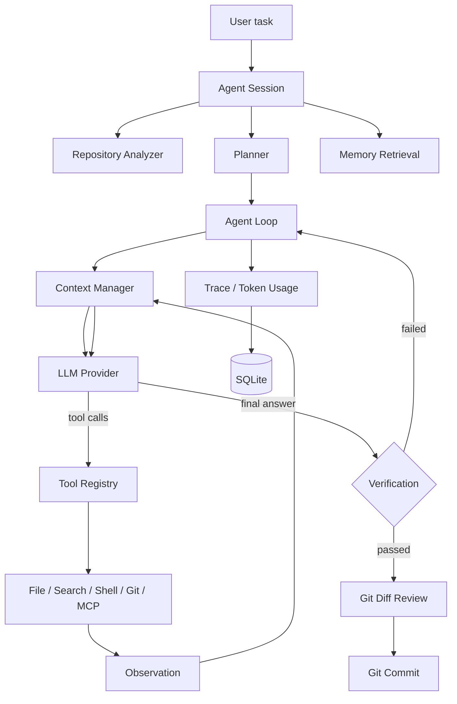

<div align="center">

# ⚡ PiX Agent

**A Minimal, Extensible & Visual Autonomous Coding Agent Runtime**

`Plan · Reason · Act · Observe · Verify · Commit`


</div>


---

## One Sentence

PiX is a coding-agent runtime that turns a sentence such as *"analyze this
project and add JWT login"* into repository analysis, tool calls, code edits,
tests, verification and a Git commit.

It is not a wrapper around a chat API. The agent loop, tool registry, context
manager, memory and tracing are implemented from scratch with typed Python,
while mature libraries handle HTTP, validation, SQLite, CLI, UI and packaging.

## Why PiX?

- No LangChain or LangGraph dependency inside the core runtime.
- One provider-neutral interface with an OpenAI Responses implementation and
  clean extension points for Anthropic, Gemini and local models.
- Real tool safety: workspace sandbox, path traversal protection, shell
  timeouts, binary/file-size guards and no Git history rewriting.
- Context engineering with token budgeting and compression instead of blind
  truncation.
- SQLite-backed sessions, traces and memories; Chroma semantic search is
  optional and falls back cleanly.
- A CLI, FastAPI and Next.js dashboard around the same runtime.
- Honest evaluation: benchmark reports only come from actual runs.

## Demo

The repository includes a small FastAPI demo project with an intentional
FizzBuzz bug. The demo creates a disposable Git workspace, enables offline
repository retrieval, and asks the single agent to fix the failing tests:

```bash
bash scripts/demo.sh
```

The demo performs one complete autonomous coding loop and prints the modified
files, final test result and trace ID:

```text
Repository Analysis
    ↓
Context Retrieval
    ↓
Planning
    ↓
Search / Read File / Shell
    ↓
Write File
    ↓
Run Tests (expected to fail)
    ↓
Verification
    ↓
Failure fed back for a fix loop
    ↓
Rerun Tests
    ↓
Report
```

It is also available as a Python module:

```bash
uv run python -m pix.demo --prepare --json
```

The automated integration test replays the same task with a scripted provider,
so the retrieval -> modify -> test -> fix closure stays repeatable without
spending model tokens.

The Autonomous Coding Dashboard uses the same deterministic path and writes a
GIF-friendly snapshot under `.demo/autonomous-coding-dashboard.json`:

```bash
uv run python -m pix.coding_demo --print-json
```

## Architecture



## Agent Loop

```text
while not finished:
    context = context_manager.build(state)
    response = llm.generate(context, tool_schemas)
    if response has tool_calls:
        for call in response.tool_calls:
            result = registry.get(call.name).execute(call.arguments)
            state.add_observation(result)
    else:
        return final_answer
```

The loop supports max iterations, provider retries, tool timeouts, cancellation
and safe error recovery. A bounded fix loop feeds failed verification output
back to the model.

## Features

- **Tool Registry**: one `Tool` contract for local and MCP tools.
- **Filesystem sandbox**: traversal-proof workspace paths, UTF-8 preference,
  binary detection and size limits.
- **Shell policy**: subprocess execution without a shell, denial of destructive
  commands, pipelines and command chaining.
- **Code search**: ripgrep JSON output with a pure-Python fallback.
- **Git tools**: status, diff, log, branch and commit. No reset or history
  rewrite operations are exposed.
- **Planner**: structured JSON plan produced before execution.
- **Verification**: detects `pytest`/`npm test` style commands and reports real
  exit code, output and duration.
- **Memory**: session ring buffer plus SQLite long-term memory, optional Chroma
  semantic retrieval and a retrieval engine.
- **Skills**: markdown instruction files loaded from disk and injected into the
  system prompt.
- **Observability**: redacted trace events, token usage and latency persisted
  per session.
- **MCP**: stdio JSON-RPC client, tool adapter and registry for external tools.
- **Evaluation**: JSON benchmark tasks, validation rules and report generation.

## Tool System

| Tool | Description |
| --- | --- |
| `list_directory` | List workspace entries with sizes |
| `read_file` | Read text inside the sandbox |
| `write_file` | Write text inside the sandbox |
| `search_code` | Ripgrep or Python fallback search |
| `run_shell` | Time-boxed process execution |
| `git_status` | Branch and working tree |
| `git_diff` | Diff against HEAD or before first commit |
| `git_log` | Recent history |
| `git_branch` | Current and available branches |
| `git_commit` | Stage and commit with a message |

## Context Engineering

Content is ordered by priority:

```text
System Instructions > User Task > Plan > Current Tool State >
Relevant Code > Recent Tool Results > Memory > Older History
```

The context manager estimates tokens, enforces a budget and marks truncation.
When the history no longer fits, `ContextCompressor` summarizes older messages
into compact facts while preserving the current task and the newest tool state.

## Memory

- `ShortTermMemory` keeps live session facts.
- `LongTermMemory` persists across sessions in SQLite.
- `MemoryStoreFacade` writes rows and, when available, indexes them in
  ChromaDB.
- `RetrievalEngine` combines recent and semantic results for the context
  builder.

ChromaDB and embedding providers are optional (`uv sync --extra memory`). When
they are not installed, recall uses SQLite keyword search instead of pretending
semantic retrieval exists.

## MCP

`StdioMCPClient` speaks JSON-RPC over stdin/stdout. `MCPToolAdapter` wraps a
remote tool as a local `Tool`, and `MCPRegistry` attaches adapters under names
such as `mcp__server__tool`.

```dotenv
PIX_ENABLE_MCP=true
PIX_MCP_SERVERS=["filesystem|npx -y @modelcontextprotocol/server-filesystem ./"]
```

## Verification

The repository analyzer detects the most likely test command from project
manifests. After a coding run, the executor runs that command and records the
real result. Failed output is returned to the model for bounded fix attempts;
there is no simulated success state.

## Observability

Events include session start, repository analysis, plan creation, context
builds, LLM requests/responses, tool calls/results, verification and errors.
Every event is redacted before persistence. `Usage` records input/output/total
tokens when the provider returns them and leaves cost `None` when pricing is
unknown.

## Quick Start

Requirements: Python 3.11+, [uv](https://docs.astral.sh/uv/) and an OpenAI API
key.

```bash
git clone <your-pix-agent-repo>
cd pix-agent
cp .env.example .env
# set OPENAI_API_KEY in .env
uv sync --extra dev
uv run pix "Explain this repository"
```

The first command is sugar for `pix run`. List sessions and inspect traces:

```bash
uv run pix sessions
uv run pix trace <session-id>
```

Run against another workspace:

```bash
uv run pix run --workspace ./examples/demo-project "Fix the failing FizzBuzz test"
```

## CLI

```bash
uv run pix run "Fix the failing tests"
uv run pix run --workspace ./demo "Add JWT authentication"
uv run pix sessions
uv run pix trace sess_abc123
uv run pix tools
uv run pix skills
uv run pix benchmark benchmarks/tasks
uv run pix serve
```

The CLI uses Rich panels, status colors and formatted tables.

## Web Dashboard

Start the API and the Next.js app in separate terminals:

```bash
uv run pix serve
cd web
npm install
npm run dev
```

Open `http://localhost:3000`. The dashboard reads live session and trace data
from the FastAPI backend, with views for Agent Run, Autonomous Coding Demo,
Sessions, Trace, Tools, Benchmark and Settings. The demo view can replay a
persisted deterministic snapshot or start a fresh scripted run from the UI.

## Project Structure

```text
pix/                  Python runtime
  agent/              planner, executor, loop, state
  providers/          LLMProvider + OpenAI Responses
  tools/              registry + sandboxed tools
  context/            budget, builder, compression
  memory/             short/long-term memory and retrieval
  mcp/                MCP client and adapters
  skills/             markdown skill loader/registry
  tracing/            events and tracer
  evaluation/         benchmark runner and metrics
  persistence/        SQLite database and repositories
  api/                FastAPI routes
web/                  Next.js + TypeScript + Tailwind dashboard
examples/             demo repositories and usage patterns
tests/                unit and integration tests
benchmarks/           JSON tasks and reports
docs/                 architecture and design documents
```

## Technical Deep Dive

- [Architecture](docs/architecture.md)
- [Agent Loop](docs/agent-loop.md)
- [Tool System](docs/tool-system.md)
- [Context Engineering](docs/context-engineering.md)
- [Memory](docs/memory.md)
- [MCP](docs/mcp.md)
- [Tracing](docs/tracing.md)
- [Security](docs/security.md)
- [Benchmark](docs/benchmark.md)

## Development

```bash
uv sync --extra dev
uv run ruff check pix tests
uv run ruff format --check pix tests
uv run mypy pix
uv run pytest
```

All tests run with the standard `pytest` command. Integration tests use a
scripted local provider and do not require network access.

## Docker

```bash
cp .env.example .env
docker compose up --build
```

The API listens on `http://localhost:8000` and the dashboard on
`http://localhost:3000`.

## Benchmark

Benchmark tasks live in `benchmarks/tasks`. Results are only generated by real
runs:

```bash
export OPENAI_API_KEY=...
uv run pix benchmark benchmarks/tasks
```

Reports are written to `benchmarks/results/`. Until a real run is executed,
the project states that benchmark data is experimental and unpublished rather
than shipping fabricated numbers.

## Roadmap

- Anthropic, Gemini and Ollama provider implementations
- Multi-agent state machine with Planner / Coder / Tester / Reviewer roles
- Interactive web run streaming and live trace playback
- Publish CI badges from real GitHub/Gitee Actions runs
- Expand benchmark tasks with verified repositories

## Contributing

Keep the core runtime framework-free, add tests for every boundary, and keep
README/docs synchronized with code. Do not ship fake demo traces or benchmark
numbers.

## License

[MIT](LICENSE)
