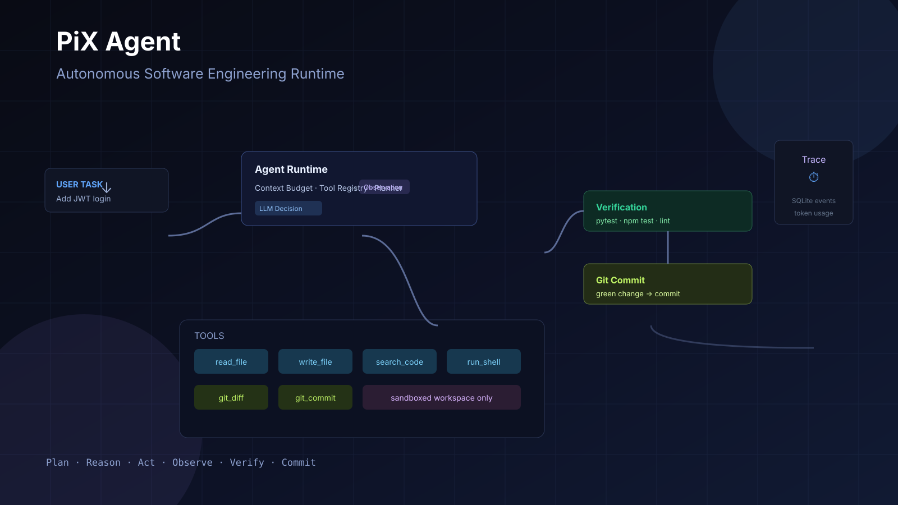
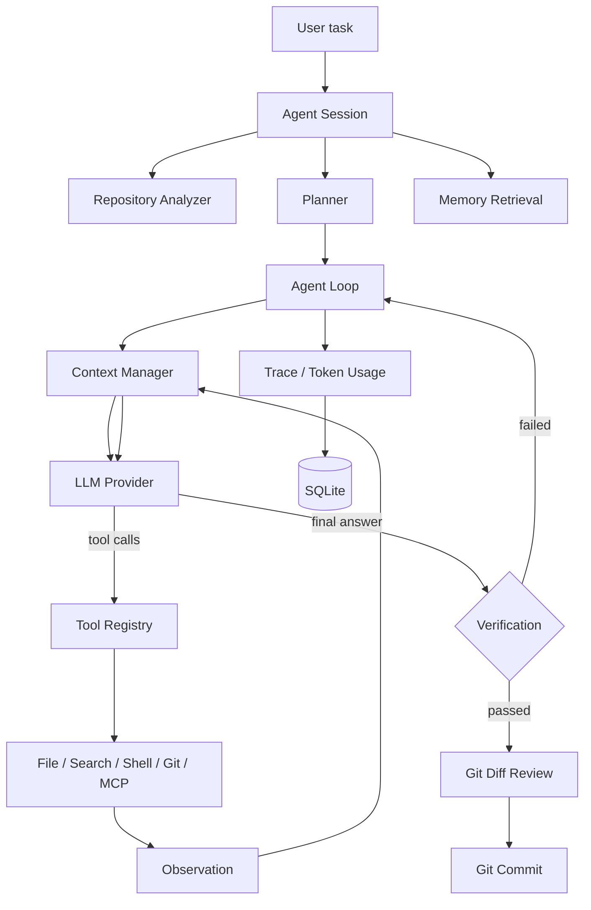

# ⚡ PiX Agent

**A Minimal, Extensible & Visual Autonomous Coding Agent Runtime**

一个从零实现的、可扩展、可观测、面向软件工程任务的 Coding Agent Runtime。

`Plan · Reason · Act · Observe · Verify · Commit`




---

## 一句话定位

PiX 是一个 Coding Agent Runtime：输入“分析这个项目，并帮我增加 JWT 登录”，
它会把这句话变成 Repository 分析、工具调用、代码修改、测试、验证和 Git
Commit。

它不是简单的 OpenAI API + Prompt + Chat。Agent Loop、Tool Registry、Context
Manager、Memory、Trace 都由本项目自己实现，并使用带类型标注的 Python 编写；
HTTP、校验、SQLite、CLI、Web UI 与打包则使用成熟基础设施。

## 为什么选择 PiX

- 核心 Agent Runtime 不依赖 LangChain / LangGraph。
- 统一 Provider 抽象，内置 OpenAI Responses API 实现，并预留 Anthropic、
  Gemini 与本地模型的扩展点。
- 真实的安全边界：Workspace 沙箱、路径穿越防护、Shell 超时、二进制与文件
  大小限制、禁止 Git 历史重写。
- Context Engineering：Token 预算与旧上下文压缩，而不是粗暴截断。
- SQLite 持久化 Sessions、Traces 与 Memory；Chroma 语义检索可选，且不可用时
  自动回退。
- CLI、FastAPI、Next.js Dashboard 都围绕同一个 Runtime 构建。
- 诚实评估：Benchmark 数据只来自真实运行，不预置伪造结果。

## Demo

仓库内置一个小型 FastAPI Demo 工程，其中有一个故意的 FizzBuzz bug。脚本会创建
独立的 Git 工作区、启用离线 Repository Retrieval，并让单 Agent 修复失败的测试：

```bash
bash scripts/demo.sh
```

Demo 执行一个完整的 Autonomous Coding 闭环，并输出修改文件、最终测试结果和
Trace ID：

```text
Repository Analysis
    ↓
Context Retrieval
    ↓
Planning
    ↓
Search / Read File / Shell
    ↓
Write File
    ↓
Run Tests（预期失败）
    ↓
Verification
    ↓
失败结果回传给修复循环
    ↓
Rerun Tests
    ↓
Report
```

也可以直接使用 Python 模块运行：

```bash
uv run python -m pix.demo --prepare --json
```

自动化集成测试使用脚本化 Provider 重放同一任务，因此
检索 -> 修改 -> 测试 -> 修复 闭环可以在不消耗模型 token 的情况下重复验证。

Autonomous Coding Dashboard 复用同一条确定性路径，并输出适合录制 GIF 的快照到
`.demo/autonomous-coding-dashboard.json`：

```bash
uv run python -m pix.coding_demo --print-json
```

## Architecture



## Agent Loop

```text
while not finished:
    context = context_manager.build(state)
    response = llm.generate(context, tool_schemas)
    if response has tool_calls:
        for call in response.tool_calls:
            result = registry.get(call.name).execute(call.arguments)
            state.add_observation(result)
    else:
        return final_answer
```

Loop 支持最大迭代次数、Provider 重试、Tool 超时、取消和安全错误恢复。验证
失败时，固定轮次的修复循环会把真实失败输出交还给模型。

## 主要能力

- **Tool Registry**：本地工具与 MCP 工具统一实现 `Tool` 契约。
- **文件系统沙箱**：防路径逃逸、UTF-8 优先、二进制检测、大小限制。
- **Shell 策略**：不使用 shell 执行子进程，拒绝危险命令、管道与命令链。
- **代码搜索**：ripgrep JSON 输出，并提供纯 Python fallback。
- **Git 工具**：status、diff、log、branch、commit；不暴露 reset 或历史重写。
- **Planner**：执行前生成结构化 JSON 计划。
- **Verification**：自动识别 `pytest`/`npm test` 等命令，记录真实退出码、
  输出和耗时。
- **Memory**：会话短期记忆 + SQLite 长期记忆 + 可选 Chroma 语义检索。
- **Skills**：从磁盘加载 Markdown 技能并注入 System Prompt。
- **Observability**：脱敏 Trace 事件、Token 用量、延迟按 Session 持久化。
- **MCP**：stdio JSON-RPC Client、Tool Adapter、Registry。
- **Evaluation**：JSON Benchmark 任务、验证规则与报告生成。

## Tool System

| Tool | 说明 |
| --- | --- |
| `list_directory` | 列出 workspace 条目及大小 |
| `read_file` | 在沙箱内读取文本文件 |
| `write_file` | 在沙箱内写入文本文件 |
| `search_code` | ripgrep 或 Python fallback 搜索 |
| `run_shell` | 有超时限制的进程执行 |
| `git_status` | 分支与工作区状态 |
| `git_diff` | 对比 HEAD 或首次提交前状态 |
| `git_log` | 最近提交历史 |
| `git_branch` | 当前分支与可用分支 |
| `git_commit` | 暂存并以 message 提交 |

## Context Engineering

上下文按以下优先级组织：

```text
System Instructions > User Task > Plan > Current Tool State >
Relevant Code > Recent Tool Results > Memory > Older History
```

Context Manager 估算 Token、执行预算并标记截断。当历史超出预算时，
`ContextCompressor` 会先把旧消息压缩为紧凑事实，同时保留当前任务和最新工具
状态。

## Memory

- `ShortTermMemory`：当前 Session 的短期事实。
- `LongTermMemory`：跨 Session 的 SQLite 持久化记忆。
- `MemoryStoreFacade`：写入 SQLite，并在可用时同步写入 ChromaDB。
- `RetrievalEngine`：组合近期结果与语义结果交给 Context Builder。

ChromaDB 与 Embedding Provider 是可选项（`uv sync --extra memory`）。未安装
时会使用 SQLite 关键词检索，而不是假装已启用语义检索。

## MCP

`StdioMCPClient` 通过 stdin/stdout 使用 JSON-RPC 通信。`MCPToolAdapter` 把远程
工具包装为本地 `Tool`，`MCPRegistry` 以 `mcp__server__tool` 形式注册：

```dotenv
PIX_ENABLE_MCP=true
PIX_MCP_SERVERS=["filesystem|npx -y @modelcontextprotocol/server-filesystem ./"]
```

## Verification

Repository Analyzer 会从项目配置推断最可能的测试命令。Coding Run 结束后，
Executor 会真实执行该命令并记录结果。失败输出会交给模型进行有上限的修复；
不存在模拟成功状态。

## Observability

事件包括 Session 启动、Repository 分析、Plan 创建、Context 构建、LLM
请求/响应、Tool 调用/结果、验证与错误。事件在持久化前统一脱敏。`Usage` 会在
Provider 返回时记录输入/输出/总 Token；未知价格时不伪造成本。

## Quick Start

要求：Python 3.11+、[uv](https://docs.astral.sh/uv/)、OpenAI API Key。

```bash
git clone <your-pix-agent-repo>
cd pix-agent
cp .env.example .env
# 在 .env 中设置 OPENAI_API_KEY
uv sync --extra dev
uv run pix "Explain this repository"
```

第一条命令等价于 `pix run`。查看 Session 与 Trace：

```bash
uv run pix sessions
uv run pix trace <session-id>
```

对指定 workspace 执行任务：

```bash
uv run pix run --workspace ./examples/demo-project "Fix the failing FizzBuzz test"
```

## CLI

```bash
uv run pix run "Fix the failing tests"
uv run pix run --workspace ./demo "Add JWT authentication"
uv run pix sessions
uv run pix trace sess_abc123
uv run pix tools
uv run pix skills
uv run pix benchmark benchmarks/tasks
uv run pix serve
```

CLI 使用 Rich Panel、状态颜色与表格输出。

## Web Dashboard

分别启动 API 与 Next.js：

```bash
uv run pix serve
cd web
npm install
npm run dev
```

访问 `http://localhost:3000`。Dashboard 从 FastAPI 后端读取真实 Session 与
Trace，包含 Agent Run、Autonomous Coding Demo、Sessions、Trace、Tools、
Benchmark、Settings 视图。Demo 页面可以回放已生成的确定性快照，也可以从 UI
重新运行脚本化 Demo。

## Project Structure

```text
pix/                  Python runtime
  agent/              planner, executor, loop, state
  providers/          LLMProvider + OpenAI Responses
  tools/              registry + sandboxed tools
  context/            budget, builder, compression
  memory/             short/long-term memory and retrieval
  mcp/                MCP client and adapters
  skills/             markdown skill loader/registry
  tracing/            events and tracer
  evaluation/         benchmark runner and metrics
  persistence/        SQLite database and repositories
  api/                FastAPI routes
web/                  Next.js + TypeScript + Tailwind dashboard
examples/             demo repositories and usage patterns
tests/                unit and integration tests
benchmarks/           JSON tasks and reports
docs/                 architecture and design documents
```

## Technical Deep Dive

- [Architecture](docs/architecture.md)
- [Agent Loop](docs/agent-loop.md)
- [Tool System](docs/tool-system.md)
- [Context Engineering](docs/context-engineering.md)
- [Memory](docs/memory.md)
- [MCP](docs/mcp.md)
- [Tracing](docs/tracing.md)
- [Security](docs/security.md)
- [Benchmark](docs/benchmark.md)

## Development

```bash
uv sync --extra dev
uv run ruff check pix tests
uv run ruff format --check pix tests
uv run mypy pix
uv run pytest
```

全部测试使用标准 `pytest` 命令。集成测试使用本地脚本化 Provider，不需要
网络或 API Key。

## Docker

```bash
cp .env.example .env
docker compose up --build
```

API 监听 `http://localhost:8000`，Dashboard 监听
`http://localhost:3000`。

## Benchmark

Benchmark 任务位于 `benchmarks/tasks`。结果只通过真实运行生成：

```bash
export OPENAI_API_KEY=...
uv run pix benchmark benchmarks/tasks
```

报告写入 `benchmarks/results/`。在没有真实运行结果前，README 与 UI 会明确标注
Benchmark 为实验性且未发布，而不是提供伪造数字。

## Roadmap

- 实现 Anthropic、Gemini、Ollama Provider
- Planner / Coder / Tester / Reviewer 的 Multi-Agent 状态机
- Web Run Streaming 与实时 Trace 回放
- 接入真实 CI，发布由 Actions 生成的测试与构建 Badge
- 扩充经过验证的 Benchmark 任务仓库

## Contributing

保持核心 Runtime 不依赖 Agent 框架；每个边界都要有测试；README 与 docs 必须
与代码同步。禁止提交伪造 Demo Trace 或 Benchmark 数字。

## License

[MIT](LICENSE)
