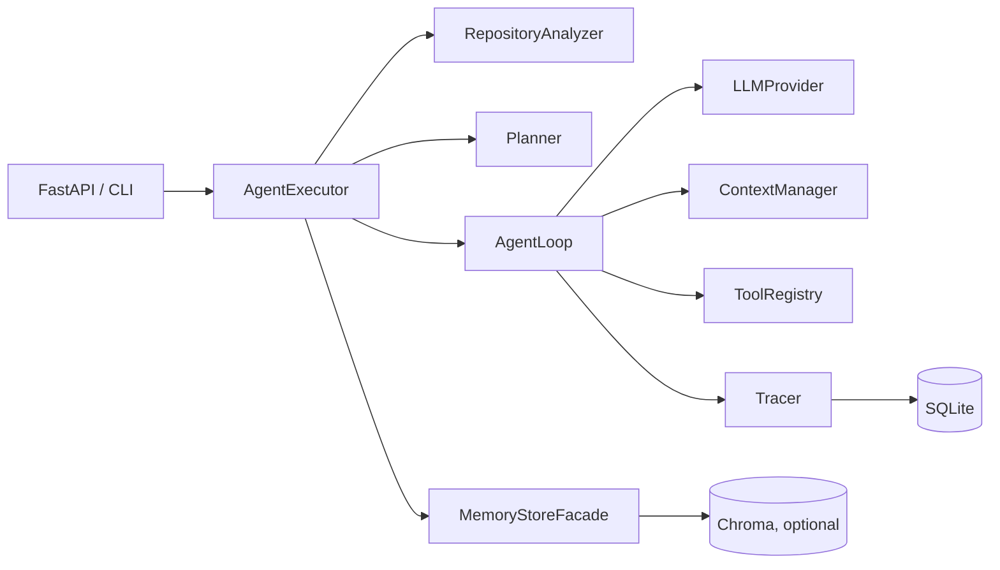

# Architecture

PiX is a coding-agent runtime built around a few explicit contracts:

1. `LLMProvider` is the only bridge to a model backend. It speaks the
   provider-neutral `ChatMessage`, `ToolCall`, `LLMResult` and `Usage` types.
2. `Tool` is the only shape that reaches an LLM through `ToolRegistry.schemas()`.
3. `ContextManager` converts state plus repository/memory/skill signals into a
   budgeted prompt context.
4. `TraceEvent` is the single observability record for every run.

The runtime never depends on LangChain or LangGraph. Orchestration lives in
`AgentExecutor`, which starts a session, analyzes the repository, calls the
planner, runs `AgentLoop`, runs verification and persists everything.

## Runtime layers

## Key decisions

- Agent state is explicit and mutable in a dataclass; every tool result becomes
  a typed `ToolObservation` and a provider-neutral tool message.
- OpenAI is implemented against the Responses API over `httpx`. Anthropic,
  Gemini and local models are extension points behind `LLMProvider`; the
  factory raises a clear error until those implementations ship.
- SQLite is the source of truth for sessions, traces and memories. ChromaDB is
  an optional semantic index; when it or embeddings are unavailable, memory
  search transparently falls back to SQLite keyword matching.
- Filesystem access is confined by `Workspace`; shell commands are non-shell
  `subprocess` calls validated by `ShellPolicy`; Git rewrites are blocked.
- Cost is never invented. Token usage is persisted when a provider returns it;
  `estimated_cost_usd` remains `None` until a known price model is applied.
